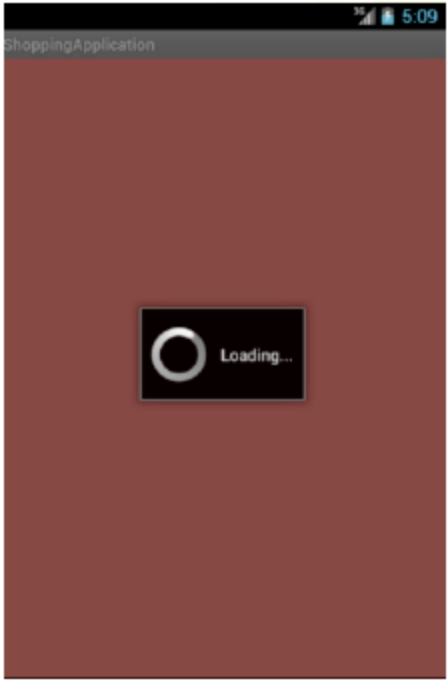
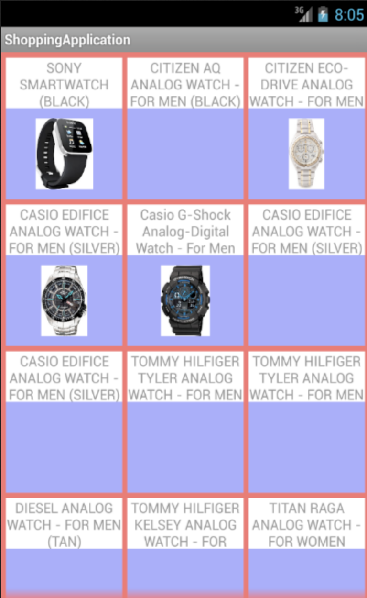

# The Other Side to Usability - Part 1

I presented the above topic at Mobile Developer Summit\(Bangalore\) on 12th October 2013 along with my colleague Abhinav Manchanda.  
This presentation intented to enable developers who generally work on an Android application and want to come up with a nice and effective application but get lost in the Usability Jargon.

**What comes to your mind when your hear the term 'Usability'?** I am sure you must have guessed the answer - Well designed, Easy to use, Stylish and good looking, Smooth, Easy to navigate through features.  
These terms can be categorized into 4 major groups namely -  
Engaging \(e.g Angry Birds\),  
Well-styled\(Apps under Google have the same style\),  
Effective\(e.g Instagram\)  
Easy to Learn \(e.g Watsapp, Viber\)


But what if your app is super engaging but before you can even engage your target audience the app takes a long time to start?  
What if your app is well-styled but functionally useless?   
What if your app is effective i.e gets the work done for you but it is difficult to navigate through the app?   
And lastly, extremely easy to learn but keeps crashing?


Usually, UI/UX developers focus on usability and application developers focus on the functionality. But at all times, one does not get to work with UX developers. In this case understanding and applying the jargon like [5Es of usability](http://www.wqusability.com/articles/getting-started.html) viz., effective, efficient, engaging, error tolerant and easy to learn, app development becomes tricky.

So, here I present some **handy tricks** that can help improve the effectiveness and usability of your application.  
Let us build a shopping application that shows us the items and if one clicks on any one of the items, you get more details of the product.

If you are only concerned about the functionality, this would be the typical workflow one would come up with:  
User launches the application -&gt; Call is made to fetch the products -&gt; Data is stored in the DB -&gt; Call to get the images


For all the above steps – the user just sees the black screen as seen above and then sees the products as below



In the above case before one can engage the user, the users will keep waiting and waiting for the app to load and then give up and uninstall the app. **The app fails to engage the user**.


The reason: **The UI thread is doing everything**.

```java
@Override
public void onCreate(Bundle savedInstance){
  super.OnCreate(savedInstance);
  setContentView(R.layout.grid_layout);

  ProductRepository productRepo = new ProductRepository();
  ArrayList<Product> products = productRepository.getProducts();

  GridView gridView = (GridView) findViewById(R.id.grid_view);
  gridView.setAdapter(new ShoppingItemsListingAdapter(this, products)); 
}
```

The `ProductRepository.getProducts` method hits a server and gets the product meta data and extracts the product information and then the information is added to the DB.

```java
public class ProductRepository {
  public ArrayList<Product> getProducts() {
    String strJSONData = new ContentFetcher()
    .fetchResponse("SERVER URL TO FETCH THE PRODUCTS");
    return new ProductsParser().parseProducts(strJSONData);
  }
}
```

And then when we try to render the grid view, the `getView` method downloads the image

```java
@Override
public void getView(int position, View convertView, ViewGroup parent){
  ImageDownloader imageDownloader = new ImageDownloader();
  Product product = products.get(position);  
  Bitmap bitmap = imageDownloader.downloadImage(product.getImagePath());
  Log.d("After image download -  Time:-", DateFormat.getDateTimeInstance().format(new Date()))

  LinearLayout layout = (LinearLayout) LayoutInflater.from(mContext).inflate(R.layout.cell_layout, null);
  ImageView imageView = (ImageView) layout.findViewById(R.id.imageView);
  TextView textView = (TextView) layout.findViewById(R.id.title);
  imageView.setImageBitmap(bitmap);
  textView.setText(product.getTitle());
  layout.setTag(product);
  retrun layout;
}
```

And all these steps are executing on the main thread i.e the UI thread.  
So, a possible solution to solve the above problem is to introduce a **loader** and then **execute all these tasks on the worker thread.**

Outcome of introducing a loader:

1. User sees the blank screen only when the application is launching
2. Loader is seen when the call is made to fetch the products
3. Loader is seen when the data is being stored to the db
4. Loader is seen when the call is made to get the images
5. All the products are rendered 



Well, atleast the users know that the app has not hung like the previous case and it is definitely executing something.  
The ProgressDialog helps us achieve the above behavior

```java
@Override
public void onCreate(Bundle savedInstance){
  super.OnCreate(savedInstance);
  setContentView(R.layout.grid_layout);

  final ProgressDialog progressDialog = ProgressDialog.show(
                                        ShoppingApplication.this,
                                        "",  "Loading...", true, true);

  GridView gridView = (GridView) findViewById(R.id.grid_view);

  Time time = new Time();
  time.setToNow();
  Log.d("Start Time:-", DateFormat.getDateTimeInstance().format(new Date()))

  new Thread(new Runnable() {
    @Override
     public void run() {
       ProductRepository productRepo = new ProductRepository();
       ArrayList<Product> products = productRepository.getProducts();
       runOnUiThread(new Runnable(){
         @Override
          public void run() {
            gridView.setAdapter(new ShoppingItemsListingAdapter(this, products)); 
            progressDialog.dismiss();
          }
       }
    }
  }
}
```


People think that adding a loader solves the problem, but in reality when a **user sees a loader**, **he/she subconsciously starts counting the seconds and therefore the user feels it is taking even longer than the blank screen**. Not really helpful !


If we think of it, **it is the images that require two calls to be fetched and rendered.** How can we solve this bottleneck?

Think about **Google Play Store** - When you want to download an application, the description and other details come up though the screenshots and videos take time to render and you do not get frustrated because you see the application in action.

Each Android app has at least one thread where its code is running. It’s called the **UI thread because it handles all drawings on the screen and user interactions.**  
Each time a text is shown, or an activity displayed, it’s on the UI thread. Each time a user taps on the screen, the UI thread identifies what and where was touched and call the appropriate functions.  
**If you perform a long running operation directly on the UI Thread, for example downloading a file from the internet, the user interface of your application will “freeze” until the corresponding task is finished.** **The** **UI** **thread will have less time to draw on the screen and respond to the user, and the app will feel slow and sluggish.**


There are two very nice and simple classes that will do it for us - **AsyncTask and IntentService**


## I have used AsyncTask as follows:

Observe the changes made to the ShoppingApplocation Activity and ProductRepository:

```java
@Override
public void onCreate(Bundle savedInstance){
  super.OnCreate(savedInstance);
  setContentView(R.layout.grid_layout);

  final ProgressDialog progressDialog = ProgressDialog.show(
                                        this,
                                        "",  
                                        "Loading...", 
                                        true, 
                                        true);

  GridView gridView = (GridView) findViewById(R.id.grid_view);
  ProductRepository productRepo = new ProductRepository();
  productRepository.getProducts(productsCallback(gridview, progressDialog));
}

private CallbackArrayList<List<Product>> productsCallback(final GridView gridview,
                                                          final ProgressDialog progressDialog) {
  return (products) -> {
    renderProducts(gridView, products);
    progressDialog.dismiss();  
  };                                                                                                                      
}                                                            

private voiud renderProducts(final GridView gridView, ArrayList<Product> products){
  gridView.setAdapter(new ShoppingItemsListingAdapter(this, products)); 
  gridView.setOnItemClickListener(adapterView, view, position, id) -> {
    Product product = (Product) adapterView.getAdapter().getItem(position);
    Intent intent = new Intent(getApplicationContext(), ProductdDetailsActivity.class);
    intent.putExtra(PRODUCT_KEY, product);
    startActivity(intent);
  });
}
```

```java
public class ProductRepository {
  public void getProducts(Callback<ArrayList<Products>> productsCallBack){
    new androidplugins.contentfetcher.ContentFetcher(responseCallback(productsCallback),
                                                     "GET")
                                                     .execute("SERVER URL");
  }

  private Callback<String> responseCallback(final Callback<ArrayList<Products>> productsCallBack) {
    return (strJSONData) -> {
      productsCallback.execute(new ProductsParser().parseProducts(strJSONData));
    };
  }
}
```

ContentFetcher extends AsyncTask and the three main methods are over-ridden as seen below:

```java
public class ContentFetcher extends AsyncTask<String, Void, String> {

    private Callback<String> callback;
    private String requestType;

    public ContentFetcher(Callback<String> callback, String RequestType) {
        this.callback = callback;
        requestType = RequestType;
    }


    @Override
    protected String doInBackground(String... url) {
        return response(url[0]);
    }

    public String response(String url) {
        HttpClient httpClient = new DefaultHttpClient();
        HttpRequestBase httpRequest = httpRequest(url);
        String result = null;
        try {
            HttpResponse httpResponse = httpClient.execute(httpRequest);
            StatusLine statusLine = httpResponse.getStatusLine();
            int statusCode = statusLine.getStatusCode();
            if (statusCode >= 200 && statusCode <= 210) {
                HttpEntity httpEntity = httpResponse.getEntity();
                InputStream content = httpEntity.getContent();
                result = toString(content);
            }
        } catch (IOException httpResponseError) {
            Log.e("HTTP Response", "IO error");
            return "404 error";
        }
        return result;
    }

    private HttpRequestBase httpRequest(String url) {
        if (requestType.equals("GET")) return new HttpGet(url);
        else if (requestType.equals("POST")) return new HttpPost(url);
        else return null;
    }
```

The result:

1. User launches the application - **Blank Screen**
2. Call is made to fetch the products - **Loader**
3. Data is stored in the DB - **Loader**
4. Call to get the images



The **UI thread is not blocked** till all the resources are fetched. Usability achieved to a certain extent!

he code for the Asynchronous Response fetching and Asynchronous Image Fetching, is usually used on multiple projects and therefore, Abhinav has put it all in one place and it can be found [here](https://github.com/androidplugins).  
**For more on executing internet intensive and heavy operations in the background:**  
[ http://www.terlici.com/2012/10/10/blazingly-fast-android-apps.html](https://github.com/NazneenR/nazneenr.github.io/tree/66256549b1e1dfd537e19c862b0a787d165f2382/2012/10/10/blazingly-fast-android-apps.html)  
[ http://androidresearch.wordpress.com/2012/03/17/understanding-asynctask-once-and-forever/](https://github.com/NazneenR/nazneenr.github.io/tree/66256549b1e1dfd537e19c862b0a787d165f2382/2012/03/17/understanding-asynctask-once-and-forever/README.md)

Some more tricks will follow in the next post.

