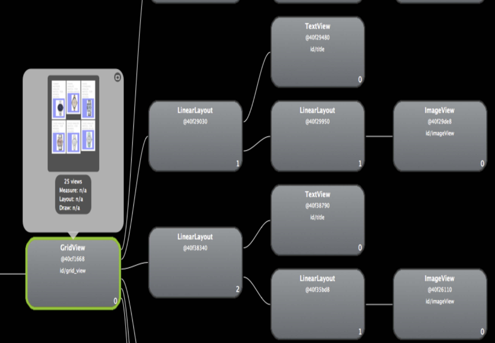
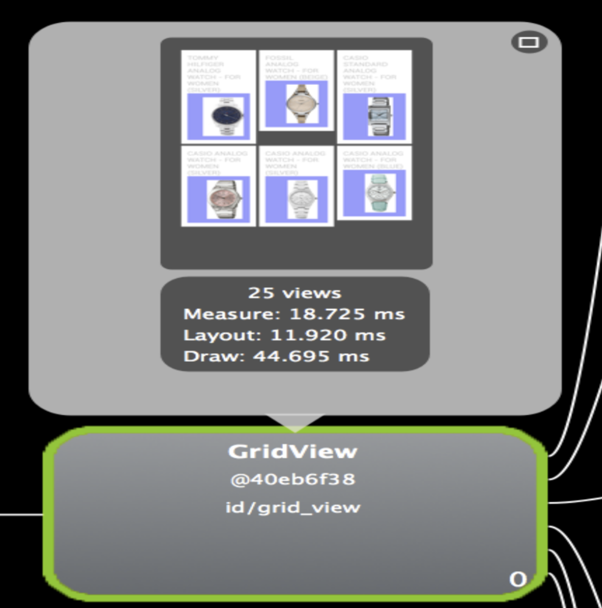
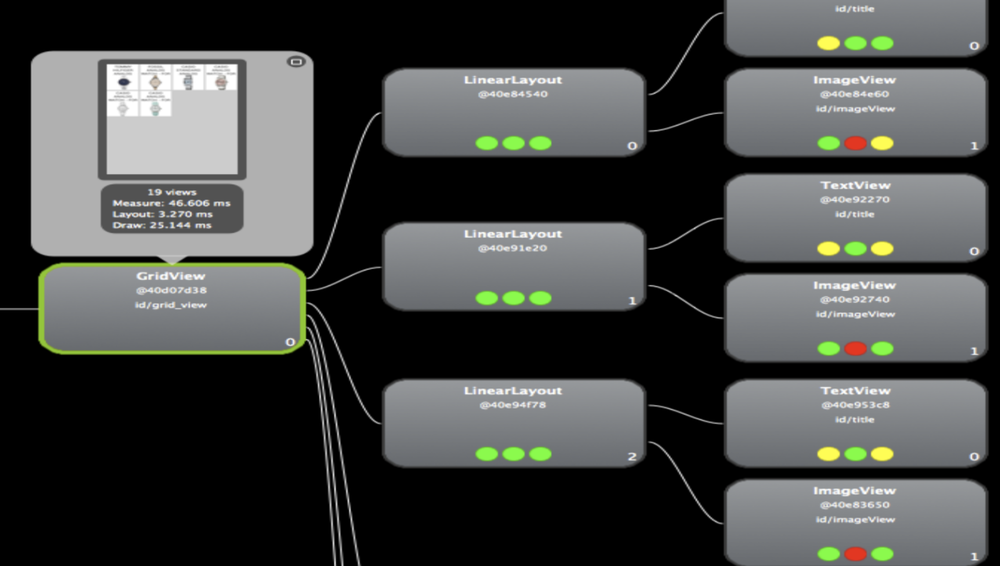
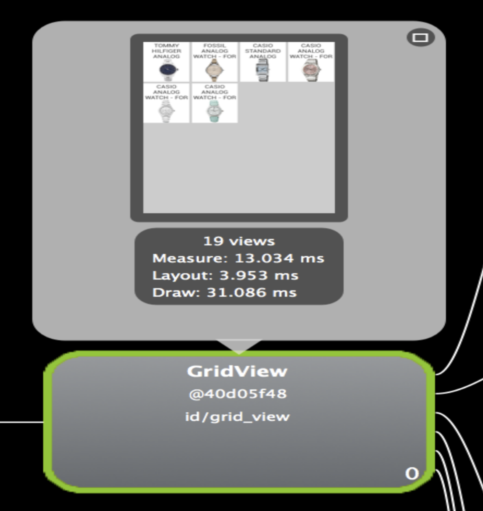

# The Other Side to Usability - Part 2

Hey there...  
As promised, listing down a few more tricks to make your Android app more usable. The previous tricks and tips can be found [here](https://nazneen-rupawalla.gitbook.io/learn-write-share/android-bits/the-other-side-to-usability-part-1).  
Now that we have achieved an amazing version 3 of our app, we still see a glaring issue.


THERE IS SIGNIFICANT LAG WHEN WE SCROLL THROUGH THE PRODUCTS.


Of course, we solved the issue of unblocking the UI thread when while loading the products, but every time we scroll up and down through the list, we have a significant delay in the thumbnails of the products appearing.  
_Yes..for the first time, it is understandable. But every time, I scroll, if I have to wait for the image, it is annoying._  
**The reason is the images are being downloaded each time you scroll.** So we need to introduce caching. [Here](https://github.com/NazneenR/ShoppingApplication/tree/master/app/src/main/java/androidplugins/imagefetcher) is an example on how to implement caching. This solves the issue at hand.

But if we look at the time the first page itself takes to load, it is significant. What can be going wrong?

Looking at the layout, we can see we have a **overdraw situation**. The topic of overdraw is very well explained here - [http://www.curious-creature.org/2012/12/01/android-performance-case-study/](http://www.curious-creature.org/2012/12/01/android-performance-case-study/)  
So following the steps, if we look at the app - **it is DARK RED**.

Viewing the application in the Hierarchy Viewer, we can see the following:

When we implement a custom view, Layout and Drawing are some standard methods that the framework calls on the view.

* **Layout is a two pass process:** a measure pass and a layout pass. The measuring pass is a top-down traversal of the view tree. Each view pushes dimension specifications down the tree during the recursion. At the end of the measure pass, every view has stored its measurements.  The second pass - i.e layout, is also top-down. During this pass each parent is responsible for positioning all of its children using the sizes computed in the measure pass.
* **Drawing** is handled by walking the tree and recording the drawing commands of any View that needs to update.


**As you can see, we have an extra Linear Layout in between the ImageView and the parent Linear Layout.** By just reducing that layer, we reduce the time for the above processes too



**Now the app loads faster, but does it look great? Is it engaging and well-styled!**


We can achieve a better look by implementing a **consistent theme**.  
For this example, we have added the `Holo.Light.DarkActionBar` theme.  
By introducing an App Level theme in `styles.xml`, it can improve the look.

| Issue | Solution |
| :--- | :--- |
| Blank Screen | Show a loader |
| Continuous loader | Load images in the background |
| Images downloaded every time on scroll | Implement caching |
| The overdraw takes time to render the view | Remove redundant layouts |
| Inconsistent coloring | Android Themes |

That's it. These are some of the guidelines if followed can help make your application usable in actual terms. :\)

